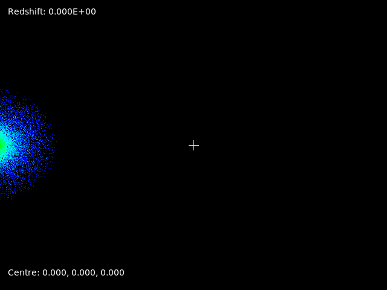
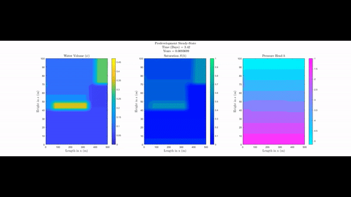

## About Me
My name is Matt Sampson, and I am a final year undergraduate student studying a double degree in Physics and Computational Mathematics. I'm very passionate about astrophysics and computational simulations.

 

## Curriculum Vitae
[Matt Sampson](Matt_Sampson_CV_Long.pdf)

## Accounts
 [Scholar](https://scholar.google.com/citations?user=iegOCeYAAAAJ&hl=en)
 [Linkedin](https://www.linkedin.com/in/matthew-sampson-b56b8113b/?originalSubdomain=au)
  [Orcid](https://orcid.org/0000-0001-5748-5393)

## Research Interests
### Computational Astrophysics:
I am interesting in how numerical simulations help us probe some the the greatest open questions in the field of astrophysics. Computational fluid dynamics is a field I am particularly interested in, and more specifically, the ability to build efficient multi-scale models to reduce the size of "the grid" when talking about sub-grid physics prescriptions.
### Computational Mathematics:
As we approach an age where it is becoming easier and easier to have acess to extremely powerful computing power, it is important to make sure our mathematical approaches to aproximating solutions takes full advantage of this compute. Massively parallel computers can be taken advatage of if we are clever about the way we build our solution methods.

## Other Interests
### Synthwave music:
Take a look at artists like [Kavinsky](https://open.spotify.com/artist/0UF7XLthtbSF2Eur7559oV), [Thomas Barrandon](https://open.spotify.com/artist/5HaHjEOMBZBDiMXP7Wz1Zr), and [Carpenter Brut](https://open.spotify.com/artist/1l2oLiukA9i5jEtIyNWIEP) if you want to have your mind transported to the nether, which is a great place to be when thinking about complicated mathematical and physical problems.
### Game Design:
Physics engines and graphics rendering are fields that fascinate me. As a former linux man I made a very brief guide to installing and set-up basics to start your graphical journey and render a beautiful triangle using OpenGL and the free Jetbrains IDE CLion ([Here it is](https://github.com/SampsonML/OpenGL_CLion_Linux_Setup)). 
